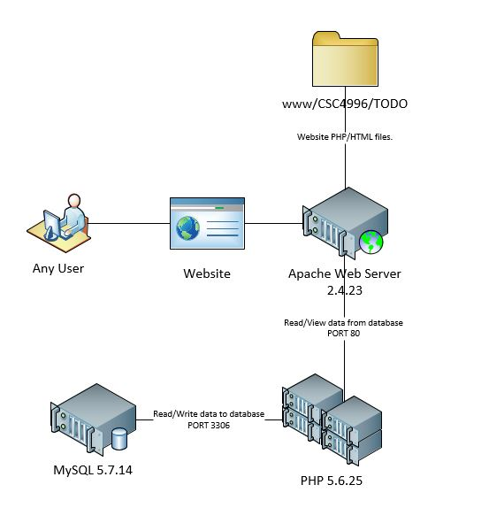
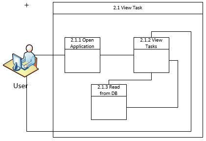
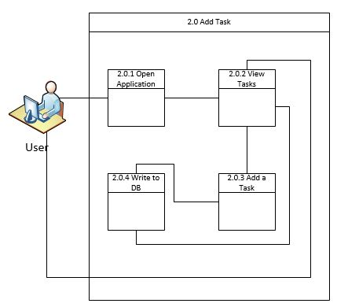
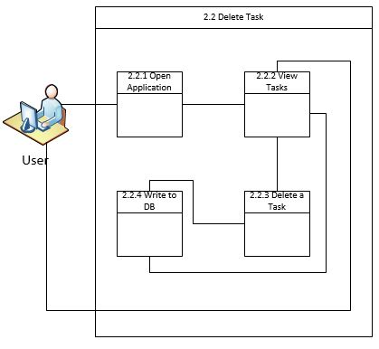

# TODO App

#### Table of Contents

1. [Description](#description)
2. [Setup - The basics of getting started with TODO App](#setup)
    * [Setup requirements](#setup-requirements)
    * [Beginning with TODO App](#beginning-with-TODO-App)
3. [Requirements](#requirements)
    * [Functional](#functional)
    * [Non-Functional](#non-functional)
4. [Use Cases](#use-cases)
5. [System Architecture Diagram](#system-architecture-diagram)
6. [Data Flow Diagrams](#data-flow-diagrams)
    * [View Task Diagram](#view-task-diagram)
    * [Add Task Diagram](#add-task-diagram)
    * [Delete Task Diagram](#delete-task-diagram)
6. [Sequence Diagram](#sequence-diagram)
7. [Database Design](#database-design)
8. [Class Diagram](#class-diagram)
9. [Test Cases](#test-cases)
10. [Work Breakdown](#work-breakdown)

## Description

This is a small application that can be used as a simple to do list. You can add tasks, view tasks and delete tasks. The prompt for this app is an assignment in order to orient myself with the WAMP development stack.

## Setup

### Setup Requirements

`TODO Create a more detailed Setup Guide`

### Beginning with the TODO Application

## Requirements
### Functional
1. User should be able to add tasks.
1. User should be able to view tasks.
1. User should be able to delete tasks.

### Non-Functional
1. Usability - Needs to be very simple to use.
1. Reliablity - Needs to be available all the time to be effective.
1. Responsiveness - In order to be simple to use it must be very responsive when adding or removing tasks.

## Use Cases

| TITLE         | Add Tasks           |
| -------------:|:--------------|
| ID:       | 01 |
| Description     | User opens the website in any browser and enters a task name and task notes in the entry fields. Then the user presses create in order to create the new task.      |
| Primary Actor | User      |
| Preconditions | User is on the app website and the database is not down      |
| Postconditions | A task has been added to the list and the database has been updated     |
| Success Scenario | <ol><li>User clicks inside of Task field and fills in the task name. </li><li>User clicks inside Notes field and fills in the description of the task to be added. </li><li>User presses the CREATE button. </li><li>System adds an id to the new task and saves the information in the database. </li><li>System displays the new task at the bottom of the task list to display the updated tasks. </li></ol> |
| Extensions |<ol><li>Task list is full.</li><li>System displays error message saying that no space is available, clear out some tasks. </li></ol>  |
| Freequency of Use: | Daily      |
| Status | Prototype      |
| Owner | Mirza Besic     |
| Priority | High      |

| TITLE         | View Tasks          |
| -------------:|:--------------|
| ID:       | 02 |
| Description     | User opens the website in any browser and views the todo tasks.   |
| Primary Actor | User      |
| Preconditions | User is on the app website and the database is not down      |
| Postconditions | User is able to view the current tasks    |
| Success Scenario | <ol><li>User opens website in any browser.</li><li>System displays the current tasks in the database.</li></ol> |
| Extensions |<ol><li>Task list is empty.</li><li>System displays a blank task list. </li></ol>  |
| Freequency of Use: | Daily      |
| Status | Prototype      |
| Owner | Mirza Besic     |
| Priority | High      |

| TITLE         | Delete Tasks           |
| -------------:|:--------------|
| ID:       | 03 |
| Description     | User opens the website in any browser and views the todo tasks. In order to delete a task the user selects the task and presses delete.      |
| Primary Actor | User      |
| Preconditions | User is on the app website and the database is not down      |
| Postconditions | A task has been removed from the list and the database has been updated     |
| Success Scenario | <ol><li>User clicks inside of drop down selector and picks task ID to be deleted. </li><li> User presses the delete button. </li><li>System deletes the corresponding task from the database. </li><li>System displays the new task list.</li></ol> |
| Extensions |<ol><li>Task list is empty.</li><li>User can't select ID from drop down select.</li><li>If delete press, system disregards request.</li></ol>  |
| Freequency of Use: | Daily      |
| Status | Prototype      |
| Owner | Mirza Besic     |
| Priority | High      |

## System Architecture Diagram

## Data Flow Diagrams
### View Task Diagram

### Add Task Diagram

### Delete Task Diagram

## Sequence Diagram

## Database Design

## Class Diagram

## Test Cases

## Work Breakdown
### Install Development Environment
* Estimated Hours: 2
* Actual time spent: 5
* Notes: Nothing remarkable.
* Issues: Port 80 problem, various Windows 10 services were blocking apache.

### Learn PHP basics
* Estimated Hours: 12
* Actual time spent: 10
* Notes: PHP is fun.
* Issues: I am far too used to Visual Studio holding my hand for syntax, refactoring, creation of classes etc.

### Write TODO Application
* Estimated Hours: 5
* Actual time spent: 3
* Notes: The time spent going through the PHP course on Udemy really helped me understand how PHP communicates with MySQL which I believe was the biggest hurdle in this application.
* Issues: PHP and MySQL syntax I am not very familiar with, so a LOT of time was spent chasing my tail over
tiny little syntax mistakes that made my SQL queries not work for example. Need to put in more time.

### Write Documentation
* Estimated Hours: 10
* Actual time spent:
* Notes:
* Issues:
